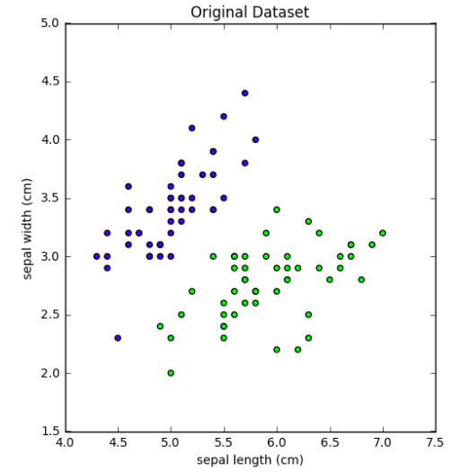
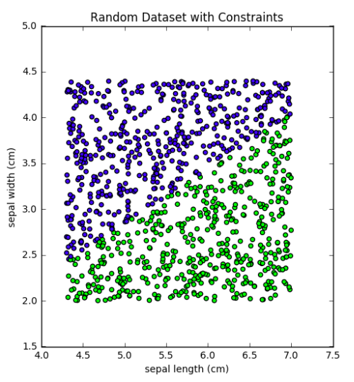

# Knowledge Hacking
This project aims at trying to uncover whether machine learning models can be cloned using a different machine learning model without having any prior knowledge of how the other model was trained or on what kind of data it was trained on.

## Approach towards the problem
We took a simplistic approach towards the problem of cloning. Since it is possible for us to perform n number of queries on the model which we need to clone, we can ask it to label (or produce output) for n number of data points and use those points to infer the working of the model. This inference can then be used to train an altogether fresh model which can work similarly to the base model. The trick here lies in the sampling of data from randomly generated uniformly distributed data and confining it under the range in which the feature values can lie for each of the corresponding data. The number of features can be known by providing model with data with zero number of features and then increasing until it is acceptable by the model. The following illustration provides a hint of what we try to achieve:






The above illustration shows that when querying the black box enough we can preserve the essence of the hyperplace with the random data and train a new model with the dataset obtained. This procedure is outlined in detail in the notebooks.

## Requirements for running the code
Make sure that both python and python install package manager (pip) is up and running. 
Python v2.7 can be installed from here https://www.python.org/downloads/
To install pip use the following command on a linux distro
```
>> sudo easy_install --upgrade pip
```
```
1. Python v2.7
2. Tensorflow v1.1
3. Numpy
4. matplotlib (optional)
4. tqdm (visualising the training)
```

## Running the code
First install the requirements so that all the libraries required are present in the environment
```
>> pip install -r requirements.txt
```

The project contains different IPython Notebooks where the experiments have been delineated. The different notebooks are described below:

**Same Classifiers.ipynb**

    This notebook containes the cloning experiments when both the models participating in the cloning procedure are same. The similar nature of models provide us with the simplicity of setting up hyperparameters and also to be sure that the model in consideration will have enough capacity to be able to solve the problem at hand


**Different Classifiers.ipynb**

    This notebook deals with the cloning procedure when both the models participating are of different statistical significance. This allows us to find how much of a model type matters when cloning is to be achienved.


**Genetic Algorithms.ipynb**

    Since finding up the features to come up with random data that can be used for the cloning procedure is of paramount importance, we try to find some smart heurestics using Genetic algorithms so that the perfect mutation can be achieved for the relevant set of features. Primitive Genetic Algorithms did not work good for our task of approximating features and hence we left this approach.

**Multiclass Classification.ipynb**

    This notebook deals with the cloning procedure when the problem is of classifying the data point into more than one classes. Since the problem is just an extension of the binary classification problem, the proposed algorithm worked fine with Multiclass Classification.


**Neural Networks.ipynb**

    The algorithm for cloning was also performed with Neural Networks. Keras was used as an implementation for a simple Artificial Neural Network. The models participating under cloning procedure were same at both the levels.


**Class Boundary.ipynb**

	Upon trying to find the hyperplane that could capture the essence of classification algorithm, we tried finding the points closest to the class boundary. This procedure was time taking and did not yield any better results and so was abandoned.


To run the Ipython Notebook install **anaconda** data science platform from here https://www.continuum.io/downloads.
Run the following command to run the notebook
```
>> jupyter notebook
```
The notebook will open in any of the default web browsers.

## Built With

* [Python](https://www.python.org/) - Programming language used
* [TensorFlow](https://www.tensorflow.org//) - Deep Learning library used
* [Jupyter Notebook](http://jupyter.org/) - For Ipython Notebook


## Authors

* **Najeeb Khan** [najeeb97khan](https://github.com/najeeb97khan)


## License

This project is licensed under the MIT License - see the [LICENSE.md](LICENSE.md) file for details

## Acknowledgments

* Prof. Debarka Sengupta - IIIT Delhi - [website](https://www.debarka.com)
* Mridul Gupta - IIIT Delhi - [mridul15061@iiitd.ac.in](mridul15061@iiitd.ac.in)

